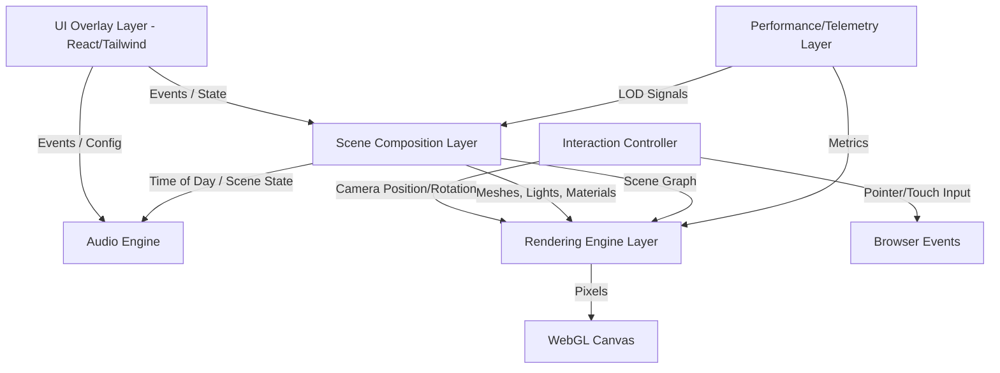

# Windermere Architecture

This document outlines the system architecture, boundaries, and data flow for the Windermere Lake Immersive Three.js Sanctuary.

## System Boundary Definition

The application is strictly separated into the following layers:

1.  **Rendering Engine Layer (`packages/engine`)**: Responsible for the low-level WebGL context, Three.js renderer configuration (tone mapping, color space), and the core animation loop. This layer wraps the raw `THREE.WebGLRenderer`.
2.  **Scene Composition Layer (`packages/engine/src/scene`)**: Responsible for assembling the Three.js scene graph. It registers scenes, manages the state machine for the time of day, and manages mesh instantiation, shaders, lighting, and environments.
3.  **Interaction Controller (`packages/engine/src/camera`)**: Handles all user input (pointer/touch/wheel) and translates it into smooth, inertial camera movements. This layer owns the `THREE.PerspectiveCamera`.
4.  **Audio Engine (`packages/audio`)**: Manages the WebAudio spatial node graph, distance-based attenuation, and scene-specific ambient sound profiles.
5.  **UI Overlay Layer (`packages/ui` and `apps/web`)**: A React/Tailwind frontend that provides an un-intrusive, minimal interface. It lives completely outside the WebGL canvas and communicates downward via state/events.
6.  **Performance/Telemetry Layer (`packages/engine` utilities)**: Monitors FPS, manages Level of Detail (LOD) degradation on low-end devices, handles WebGL context loss recovery, and feature flags.

## Architecture Diagram

## Data Flow & State Management

The core principle of Windermere's architecture is **unidirectional state ownership**.

1.  **Application State (React)**: The React layer in `apps/web` holds the high-level application state (e.g., current active scene, UI visibility toggles, audio mute state).
2.  **Engine Config (Three.js)**: State flows from React *down* to the Engine. The Engine exposes imperative APIs or configuration objects that React updates when the state changes. The Engine *never* updates React state directly.
3.  **Interaction State (Camera)**: The `CameraController` manages its own internal physics state (velocity, damping, target rotation). This state is tightly bound to the animation loop and is deliberately isolated from the React state to prevent slow render cycles from interrupting the smooth 60fps interaction.
4.  **Scene State (Time of Day)**: The `TimeOfDayStateMachine` manages the transitions between Dawn, Midday, and Twilight. This dictates the active lighting, audio, and visual features. When the scene transitions, it publishes an event (or relies on GSAP tweens) to smoothly interpolate uniforms and properties.

By keeping these boundaries strict, we ensure that the rendering loop remains decoupled from UI updates, preserving the serene, uninterrupted nature of the experience.
